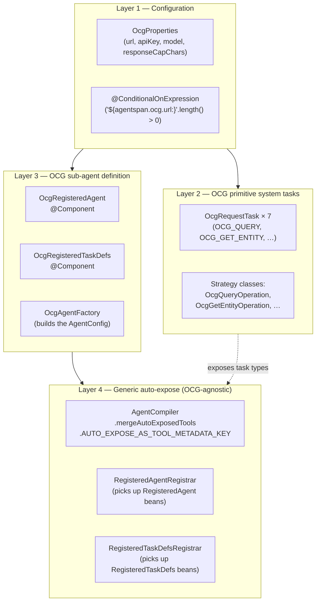
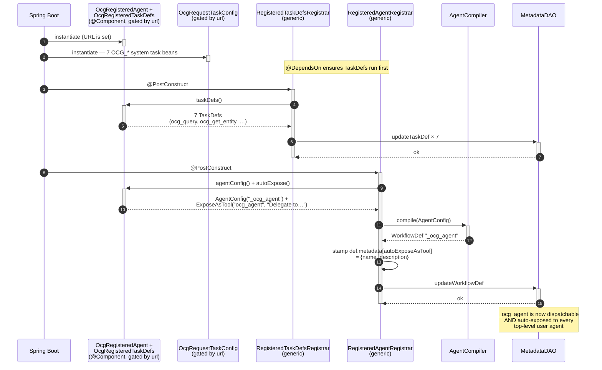
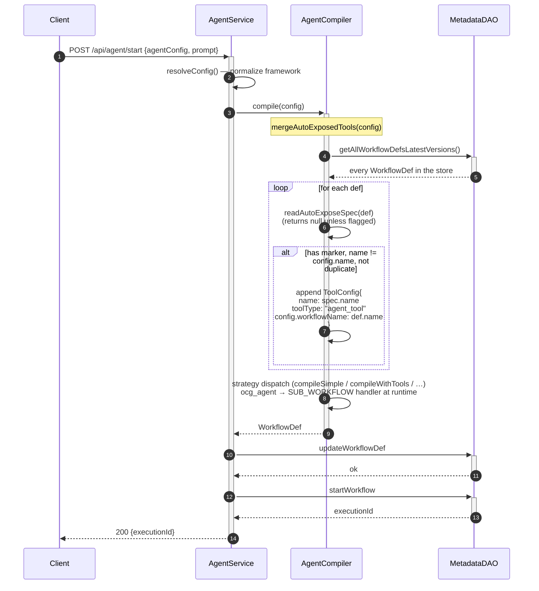
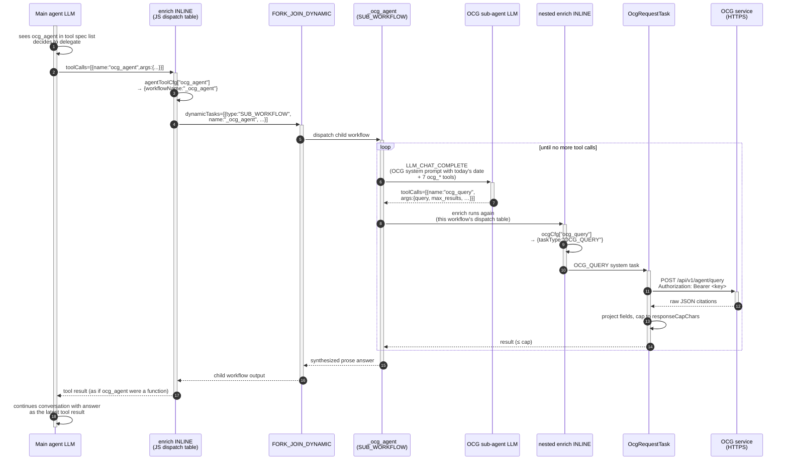

# OCG Sub-Agent

A built-in retrieval sub-agent that any user's LLM can delegate to mid-loop
when it needs context from the Open Context Graph (OCG) — Slack messages,
Jira tickets, code history, stored memories. Enabled by setting
`OCG_URL`. Disabled by leaving it unset.

The feature is also the **first consumer of a generic
`RegisteredAgent` registry pattern**: any future server-side sub-agent
plugs in as one `@Component` without touching `AgentCompiler`,
`AgentService`, or any per-feature `@PostConstruct` boilerplate.

---

## Setup — integrating OCG with AgentSpan

OCG is fully opt-in. The integration is **two environment variables** the
AgentSpan server reads at startup:

| Env var       | Required?           | What it does                                                                                                  |
| ------------- | ------------------- | ------------------------------------------------------------------------------------------------------------- |
| `OCG_URL`     | **Yes** (to enable) | Base URL of your OCG instance, e.g. `https://dev.orkescontextgraph.io`. If unset or empty, every OCG bean stays out of the Spring context, no `_ocg_agent` workflow is registered, and no user agent gets the auto-injected `ocg_agent` tool. The feature is completely dormant. |
| `OCG_API_KEY` | Yes (if OCG requires auth) | Bearer token sent as `Authorization: Bearer <key>` on every OCG HTTP request. Empty means no auth header — fine for unauthenticated local OCG instances; required for the hosted dev / prod instances. |

### Local dev

When starting the server (via `./gradlew bootRun`, IntelliJ run config,
or `java -jar`):

```bash
export OCG_URL=https://dev.orkescontextgraph.io
export OCG_API_KEY=<your-bearer-token>
export OPENAI_API_KEY=sk-...    # the OCG sub-agent also needs an LLM key
./gradlew bootRun
```

In IntelliJ, add the same three to your Spring Boot run configuration's
**Environment variables** field.

### Docker / production

Pass them through whatever your deployment system uses — docker `-e`,
Kubernetes `env`, Helm values, systemd `EnvironmentFile`, etc. They map
to Spring properties via `application.properties`:

```
agentspan.ocg.url=${OCG_URL:}
agentspan.ocg.api-key=${OCG_API_KEY:}
```

So you can alternatively pass them as Spring properties on the JVM
command line (`-Dagentspan.ocg.url=…`) or via a `SPRING_APPLICATION_JSON`
blob if your platform prefers that.

### Verifying it's enabled

After the server starts with `OCG_URL` set you should see these three
lines in the log:

```
INFO  dev.agentspan.runtime.registry.RegisteredTaskDefsRegistrar — Registered 7 TaskDef(s) from 1 supplier(s)
INFO  dev.agentspan.runtime.registry.RegisteredAgentRegistrar — Registered agent: workflow='_ocg_agent' autoExposeAs='ocg_agent'
INFO  dev.agentspan.runtime.registry.RegisteredAgentRegistrar — Registered 1 server-side agent(s)
```

Two quick HTTP checks:

```bash
# 1. The OCG sub-agent workflow is registered
curl -s http://localhost:6767/api/metadata/workflow/_ocg_agent | jq .name
# → "_ocg_agent"

# 2. The OCG primitive TaskDefs are registered
curl -s -o /dev/null -w "%{http_code}\n" http://localhost:6767/api/metadata/taskdefs/ocg_query
# → 200
```

If `OCG_URL` is unset, both endpoints return 404 — that's the disabled
state.

### Optional tuning knobs

| Property                           | Default              | Effect                                                                       |
| ---------------------------------- | -------------------- | ---------------------------------------------------------------------------- |
| `agentspan.ocg.model`              | `openai/gpt-4o-mini` | LLM the OCG sub-agent uses internally. Override via `OCG_MODEL` env or `-Dagentspan.ocg.model=…`. |
| `agentspan.ocg.response-cap-chars` | `8192`               | Per-call response truncation budget. Raise if your model context allows; lower to save tokens. |

---

## 1. Architecture in one picture



Reading bottom-up: each layer is independent of the ones above it.
**Removing OCG entirely means deleting layers 1-3; layer 4 stays generic
and useful for any other server-side sub-agent.**

---

## 2. Startup — the registry does the work



The registrars know nothing about OCG. They iterate `List<RegisteredAgent>`
and `List<RegisteredTaskDefs>` provided by Spring, run each through a
fixed pipeline (compile + stamp + persist for agents; persist for
TaskDefs), and call it a day. OCG just happens to be the one feature
providing those beans today.

---

## 3. Compile-time merge — how every user agent gets `ocg_agent`



Guards inside the merger:

| Guard            | Why                                                                |
| ---------------- | ------------------------------------------------------------------ |
| No `MetadataDAO` | Unit tests using `new AgentCompiler()` should still work          |
| Self-recursion   | Re-compiling `_ocg_agent` itself won't inject itself as a tool    |
| Duplicate name   | A caller's explicit declaration wins                              |

---

## 4. Runtime delegation — the nested agent dispatch



The same compiled-workflow shape (LLM → enrich → fork → join → loop) runs
at **both** levels — the outer dispatches `SUB_WORKFLOW`, the inner
dispatches `OCG_QUERY` and friends. That's because `_ocg_agent` is just
another `AgentConfig` compiled through the same `AgentCompiler.compile()`
pipeline that produced the user's agent.

---

## 5. The seven OCG operations

All endpoints sit under `${agentspan.ocg.url}/api/v1`. Each is backed by
a strategy class implementing `OcgOperation` (under
`runtime/ocg/operation/`); `OcgRequestTask` is a thin orchestrator that
delegates URL/method/body/projection to the strategy.

| Tool name (LLM-visible) | System task type      | Endpoint                                 | Method   |
| ----------------------- | --------------------- | ---------------------------------------- | -------- |
| `ocg_query`             | `OCG_QUERY`           | `/api/v1/agent/query`                    | `POST`   |
| `ocg_get_entity`        | `OCG_GET_ENTITY`      | `/api/v1/entities/{entity_id}`           | `GET`    |
| `ocg_neighborhood`      | `OCG_NEIGHBORHOOD`    | `/api/v1/graph/neighborhood/{entity_id}` | `GET`    |
| `ocg_code_history`      | `OCG_CODE_HISTORY`    | `/api/v1/code/history/{repo_id}`         | `GET`    |
| `ocg_memory_set`        | `OCG_MEMORY_SET`      | `/api/v1/memories`                       | `POST`   |
| `ocg_memory_reinforce`  | `OCG_MEMORY_REINFORCE`| `/api/v1/memories/{key}/reinforce`       | `POST`   |
| `ocg_memory_delete`     | `OCG_MEMORY_DELETE`   | `/api/v1/memories/{key}`                 | `DELETE` |

---

## 6. Why `@ConditionalOnExpression` instead of `@ConditionalOnProperty`

The OCG `@Component`s use:

```java
@ConditionalOnExpression("'${agentspan.ocg.url:}'.length() > 0")
```

rather than the more obvious `@ConditionalOnProperty(name = "url")`
because Spring's default for the latter is *"present and not equal to
false"* — an empty string satisfies that and would load every OCG bean
even with `OCG_URL` unset. The expression form requires a non-empty
value, which matches the intent.

---

## 7. Adding a new server-side sub-agent

Drop one `@Component`. That's it.

```java
@Component
@ConditionalOnExpression("'${agentspan.myfeature.url:}'.length() > 0")
@RequiredArgsConstructor
public class MyRegisteredAgent implements RegisteredAgent {

    private final MyFeatureProperties properties;

    @Override
    public AgentConfig agentConfig() {
        return MyAgentFactory.build(properties);
    }

    @Override
    public ExposeAsTool autoExpose() {
        return new ExposeAsTool(
                "my_agent",
                "Use this when …");
    }
}
```

If your agent has primitive system tasks that need TaskDef entries
(most pure-LLM sub-agents won't), add one more:

```java
@Component
@ConditionalOnExpression("'${agentspan.myfeature.url:}'.length() > 0")
public class MyRegisteredTaskDefs implements RegisteredTaskDefs {
    @Override
    public List<TaskDef> taskDefs() {
        return List.of(/* … */);
    }
}
```

**No `AgentCompiler` edit. No `AgentService` edit. No
`@PostConstruct registerWorkflow()`. No per-feature service class.** The
generic registrars handle the rest.
