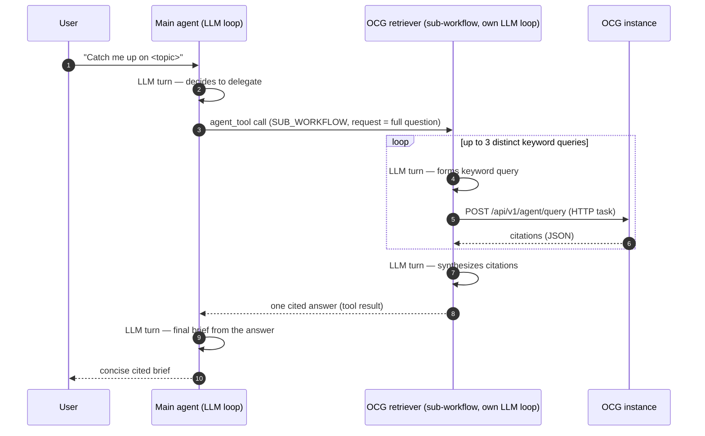
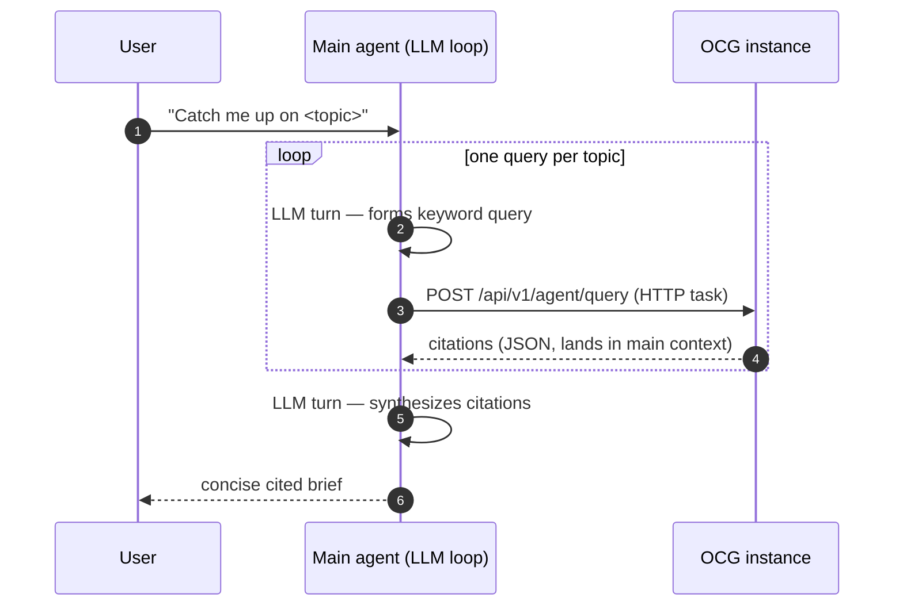
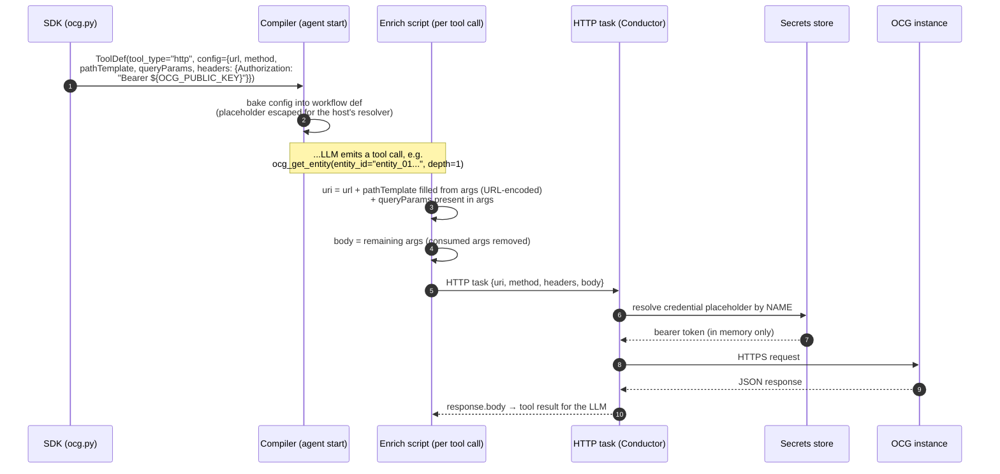

# OCG Retrieval Agents

OCG (Open Context Graph) is a retrieval engine over a knowledge graph of
entities — messages, channels, people, tickets — linked by claims and
relationships. It is embedding/keyword search exposed as an HTTP API, not
an LLM.

AgentSpan's OCG integration lives **entirely in the Python SDK**
(`agentspan.agents.ocg`): the retrieval system prompt, the tool schemas,
the endpoint routing, and the instance binding. The tools compile to plain
Conductor HTTP tasks, so **any AgentSpan server runs them with zero
OCG-specific configuration** — no properties, no task types, nothing to
enable.

OCG is opt-in per agent: an agent that doesn't declare OCG tools never
makes an OCG call.

---

## Two shapes

### 1. Sub-agent — delegate retrieval

`ocg_agent()` returns an ordinary `Agent` carrying the canned retrieval
prompt and the `ocg_*` tools. Wrap it with `agent_tool()` and the main
agent's LLM sees a single tool; calling it runs the retriever as a
sub-workflow with its own LLM loop, which returns one synthesized, cited
answer.

```python
from agentspan.agents import Agent, agent_tool
from agentspan.agents.ocg import ocg_agent

retriever = ocg_agent(
    model="openai/gpt-4o-mini",
    url="https://dev.orkescontextgraph.io",
    credential="OCG_PUBLIC_KEY",        # secrets-store NAME, never the key
)

main = Agent(
    name="support",
    model="openai/gpt-4o",
    instructions=(
        "Call your retrieval tool exactly once, passing the user's full "
        "question. Its answer is complete: when it returns, write your "
        "final response as a concise cited brief of what it found."
    ),
    tools=[agent_tool(retriever)],
    max_turns=4,
)
```



Choose this shape when retrieval takes judgment — several queries,
neighborhood walks, two-step aggregation. The raw citations stay inside
the retriever's context; the main agent only ever sees the synthesized
answer.

### 2. Direct tools — the main agent queries itself

`ocg_tools()` returns the raw `ToolDef`s. Attach them (or a subset) to
your own agent and its LLM issues the queries directly — no sub-workflow
hop, roughly half the tokens for simple lookups, but the raw citations
land in the main agent's context and the retrieval prompting is yours to
write.

```python
from agentspan.agents import Agent
from agentspan.agents.ocg import ocg_tools

main = Agent(
    name="support",
    model="openai/gpt-4o-mini",
    instructions=(
        "Answer using ocg_query, a keyword/embedding retrieval tool (NOT "
        "an LLM). Query with specific keywords, never questions. At most "
        "one query per topic; then write your final brief from the "
        "citations."
    ),
    tools=ocg_tools(
        url="https://dev.orkescontextgraph.io",
        credential="OCG_PUBLIC_KEY",
        entities=False,      # subset switches: query / entities / memory
        memory=False,        # → ocg_query only
    ),
    max_turns=6,
)
```



---

## How a tool call executes

There is no OCG code on the server. The SDK bakes everything the dispatch
needs into each tool's config at definition time; the compiled workflow's
enrich script (compile-time JavaScript, evaluated at dispatch) turns the
LLM's arguments into a standard Conductor HTTP task.



Key properties:

- **Per-tool instance binding.** `url=` is required — every OCG tool set
  binds the instance it talks to. Different agents can target different
  graphs (e.g. a US retriever and a Canada retriever in one router agent);
  agents bound to different instances must have distinct `name`s.
- **Secrets never leave the server.** `credential="OCG_PUBLIC_KEY"` is a
  *name*. It compiles to a standard HTTP-tool header placeholder, resolved
  from the server's secrets store at execution — the token never appears
  in Python code, serialized configs, or workflow definitions. Store it
  once (e.g. orkes UI → Secrets, or `PUT /api/secrets/OCG_PUBLIC_KEY`).
- **Path templating is generic.** `pathTemplate`/`queryParams` on an
  `http` tool config is a general AgentSpan capability; OCG is simply its
  first user.

---

## The tools

Endpoint routing lives in `agentspan/agents/ocg.py` and compiles into each
tool's HTTP config:

| Tool (LLM-visible)     | Endpoint                                 | Method   |
| ---------------------- | ---------------------------------------- | -------- |
| `ocg_query`            | `/api/v1/agent/query`                    | `POST`   |
| `ocg_get_entity`       | `/api/v1/entities/{entity_id}`           | `GET`    |
| `ocg_neighborhood`     | `/api/v1/graph/neighborhood/{entity_id}` | `GET`    |
| `ocg_memory_set`       | `/api/v1/memories`                       | `POST`   |
| `ocg_memory_reinforce` | `/api/v1/memories/{key}/reinforce`       | `POST`   |
| `ocg_memory_delete`    | `/api/v1/memories/{key}`                 | `DELETE` |

Path params (`{entity_id}`, `{key}`) are filled from the LLM's tool
arguments and URL-encoded; listed query params are appended when present;
everything else becomes the JSON body.

Subset switches on `ocg_tools()` / `ocg_agent()`: `query`, `entities`
(get_entity + neighborhood), `memory` (set / reinforce / delete).

## Keeping the LLM honest

OCG responses are injected verbatim into the calling LLM's context, so the
schemas and the canned prompt enforce discipline:

- `max_results` carries a schema-level **`maximum: 100`** (default 10);
  the prompt recommends ≤ 25.
- `traversal_level` defaults to **0** (citations only) — each level
  multiplies response size.
- `start_time`/`end_time` must be **full RFC3339**
  (`2026-06-04T00:00:00Z`); the OCG API rejects bare dates, and the
  schemas say so to prevent retry loops.
- The canned retrieval prompt budgets **at most 3 distinct keyword
  queries** per request, forbids rephrasing (embedding search returns the
  same results for the same intent), anchors relative dates on an
  execution-time `__today__`, and instructs keyword-style queries under
  ~15 content words.

`ocg_agent()` defaults to `max_turns=10`; give your *main* agent explicit
retrieval instructions and a small `max_turns` (see the examples) so it
treats the retriever's answer as complete instead of paging for
continuations.

## Running the examples

```bash
# one-time: store the OCG bearer token in the server's secrets store
#   e.g. orkes UI → Secrets → OCG_PUBLIC_KEY, or
#   curl -X PUT http://localhost:8080/api/secrets/OCG_PUBLIC_KEY -d '"<token>"'

cd sdk/python

# sub-agent shape
OCG_INSTANCE_URL=https://dev.orkescontextgraph.io \
OCG_CREDENTIAL=OCG_PUBLIC_KEY \
AGENTSPAN_SERVER_URL=http://localhost:8080/api \
uv run python examples/116_ocg_subagent.py

# direct-tools shape
OCG_INSTANCE_URL=https://dev.orkescontextgraph.io \
OCG_CREDENTIAL=OCG_PUBLIC_KEY \
AGENTSPAN_SERVER_URL=http://localhost:8080/api \
uv run python examples/117_ocg_direct_tools.py
```

`AGENTSPAN_SERVER_URL` defaults to the standalone server
(`http://localhost:6767/api`); point it at an embedded host (e.g.
orkes-conductor on 8080) as above.

## API reference

See [Python SDK API Reference → ocg_agent() / ocg_tools()](python-sdk/api-reference.md)
for the full parameter tables. Design history lives under
[`docs/design/`](design/2026-06-12-ocg-sdk-subagent-design.md).
